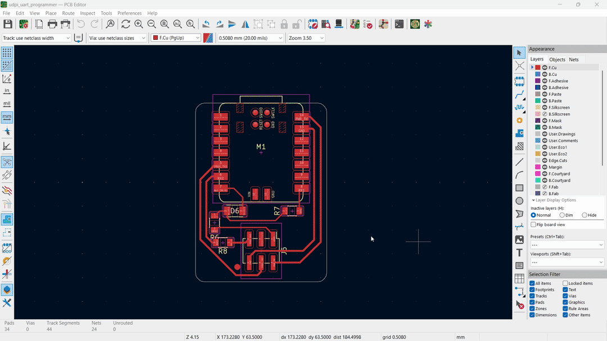
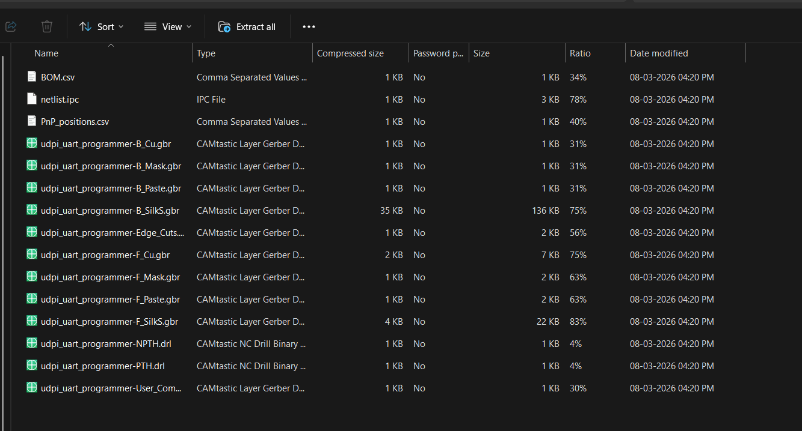
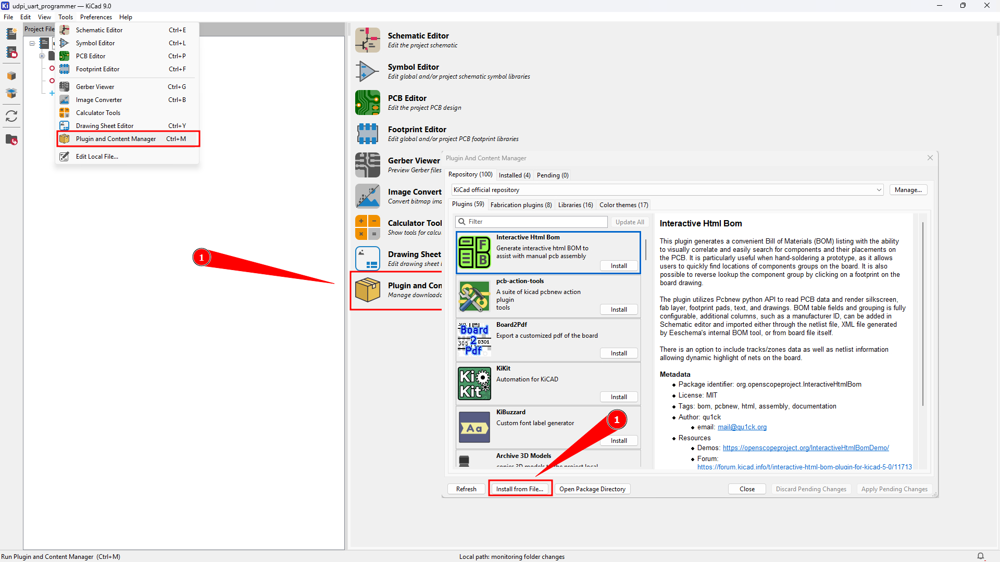
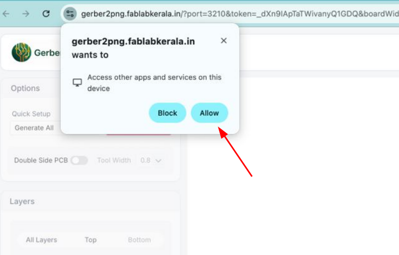

# Gerber2Png Plug-in for KiCad

Export manufacturing files from KiCad and send them to the [Gerber2Png web app](https://gerber2png.fablabkerala.in/) in one click.

This plugin is designed for Fab Lab PCB milling workflows, where Gerber2Png is used to create high-quality PNG files for single-side and double-side PCB production with [mods](http://modsproject.org/).

## What the plugin does

When you run the plugin from KiCad PCB Editor, it will:

1. Generate manufacturing outputs from the active board.
2. Package them into a ZIP file.
3. Open Gerber2Png in your default browser with board parameters.
4. Provide the ZIP to the web app through a local one-time transfer.

After that, PNG generation is completed on the Gerber2Png website (frontend workflow).

## Generated files

The plugin prepares these files before upload:

- Gerber files (enabled PCB layers)
- Drill files
- `netlist.ipc` (IPC-356)
- `BOM.csv`
- `PnP_positions.csv`

a zip folder will be made by this plugin inside your project folder, that contans all the mentioned files above, check out the example in the bellow image 

## Installation

### Manual installation (current method)

1. Download the latest release ZIP:
   [KiCadToGerber2Png_v1.0.0.zip](https://github.com/fabalabkerala/Gerber2Png-Plug-in-for-Kicad/releases/download/v1.0.0/KiCadToGerber2Png_v1.0.0.zip)
2. Open KiCad.
3. Go to **Plugin and Content Manager**.
4. Click **Install from File** and select the downloaded ZIP.
5. Open PCB Editor and run the plugin from **Tools -> External Plugins**.

### KiCad PCM repository status

Installation from the official KiCad plugin repository is not available yet.

## Typical workflow

1. Open your board in KiCad PCB Editor.
2. Run **Gerber2Png Plug-in for KiCad**.
3. Wait for export and browser launch.
4. Gerber2Png receives the ZIP and loads your project.
5. Continue in Gerber2Png to generate milling-ready PNG outputs.

Note:- As part of the security your browser will ask you to allow access for the plugin.  it will be only a onetime ask then you don't need to mind   

## Compatibility

- KiCad: 6, 7, 8, 9
- OS: Windows, Linux, macOS

## Background

This plugin was inspired by the [PCBWay KiCad plugin](https://github.com/pcbway/PCBWay-Plug-in-for-Kicad), which also automates a manufacturing upload workflow from KiCad.

Gerber2Png is developed by [Fab Lab Kerala](https://github.com/fabalabkerala) and is widely used in the Fab Lab and Fab Academy community.

- Gerber2Png web app: <https://gerber2png.fablabkerala.in/>
- Gerber2Png wiki: <https://github.com/fabalabkerala/gerber2png/wiki>

## Credits

- Plugin author: [Saheen Palayi](https://saheenpalayi.com/)
- Contributor: [Midlaj N](https://github.com/MidlajN)

## License

MIT License. See [LICENSE](LICENSE).
